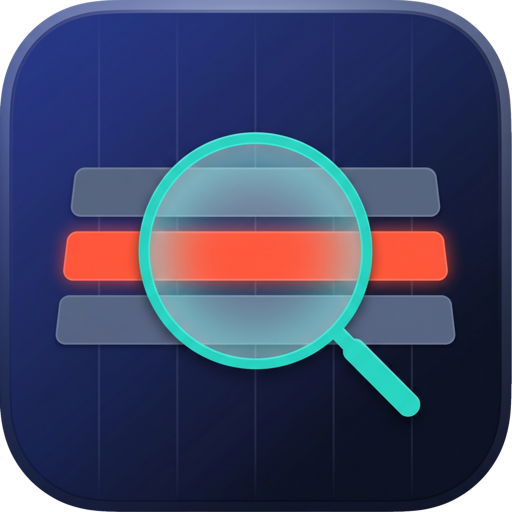

<div align="center">



# NexusView

### Open a multi‑gigabyte forensic timeline **instantly**. Native macOS triage for DFIR & SOC.

[](#)
[](#)
[](#)
[](#)
[](#)
[](LICENSE)

*A split‑engine app: a **Rust** core that memory‑maps and indexes evidence files,
behind a **Swift / AppKit** UI that stays at 60 FPS — no Electron, no JVM, no
import step.*

</div>

---

## Why NexusView

Incident responders live in giant CSVs — EDR exports, `EvtxECmd` output, bodyfiles,
unified KAPE/Hayabusa timelines. The usual tools either **choke** (Excel, Electron
viewers) or make you **wait minutes** while they import everything into SQLite.

NexusView never loads the file. It **memory‑maps** it, scans once for line
offsets, and shows you row 1 in milliseconds — whether the file is 100 thousand
rows or 50 million. Everything heavy (parsing, search, sort, grouping) runs in
parallel **off the UI thread**, so the grid never beach‑balls.

---

## Features

🔎 **Search that thinks like an analyst** — boolean `AND/OR/NOT`, parentheses,
quoted phrases, ARM‑optimized `/regex/`, and per‑column scope (`host:web01`).
Selective substrings are accelerated by per‑block **trigram Bloom filters**.

⚡ **Zero‑load architecture** — `mmap` + binary line‑offset index. Opens 50 GB
files instantly; the engine, not the heap, holds the data.

🏷️ **Tagging** — flag rows of interest with a checkbox column; tags persist
across every filter, sort, and group. *Show tagged only* in one click.

🧮 **Sort · Group · Hide** — stable multi‑column sort (numeric‑aware), multi‑level
grouping into a tree, drag to reorder columns, hide columns (excluded from export).

🕒 **Timestamps & timezones** — auto‑detects ISO‑8601 and Unix epoch
(seconds / milliseconds) columns; convert the whole view to **UTC** or **local**.

🛡️ **IOC enrichment** — recognizes MD5 / SHA‑1 / SHA‑256 and IPv4 / IPv6 in any
cell; right‑click → **look it up on VirusTotal**.

📋 **Spreadsheet‑grade clipboard** — select cells, ranges, columns or rows;
**smart paste** turns a pasted list of IOCs into an `OR` filter automatically.

🗂️ **Sessions & tabs** — native macOS tabs (one isolated engine each);
**save/load sessions** (`.nexussession`) that restore filters, sort, grouping,
hidden columns, and tags.

🎨 **Tactical conditional formatting** — color rules evaluated only on visible
cells, so it stays free at any file size.

🤖 **MCP server** — a local Model Context Protocol server exposes open timelines
to LLM agents (`search`, `get_rows`, `column_distribution`, …) for SOC automation.

---

## Architecture

```
┌──────────────────────────────────────────────────────────────┐
│  app/   Swift + AppKit   — main thread = UI only (RNF-01)      │
│   virtualized NSTableView / NSOutlineView · async file open    │
└───────────────▲──────────────────────────────────────────────┘
                │  C ABI — opaque handles + viewport slices only
┌───────────────┴──────────────────────────────────────────────┐
│  engine/nexus-ffi    cdylib + staticlib  (panic-safe boundary) │
├──────────────────────────────────────────────────────────────┤
│  engine/nexus-core   pure Rust, UI-agnostic                    │
│    mmap → LineIndex → Dataset(schema) → Query → View           │
│    memmap2 · memchr (SIMD) · rayon · regex · trigram Bloom      │
├──────────────────────────────────────────────────────────────┤
│  engine/nexus-mcp    MCP server (JSON-RPC / stdio) over core    │
└──────────────────────────────────────────────────────────────┘
```

The same Rust core powers the app, a headless CLI example, and the MCP server —
it never depends on any UI (RNF‑04). The bridge passes pointers and exact
viewport cells, never bulk rows.

---

## Quick start

**Requirements:** macOS 13+, Apple Silicon, [Rust](https://rustup.rs) (stable),
Swift 5.9+ (Xcode or Command Line Tools).

```bash
git clone https://github.com/dathannobrega/NexusView.git
cd NexusView

./scripts/build_app.sh                                   # → build/NexusView.app
open -a build/NexusView.app samples/incident_sample.csv
```

Build a signed, drag‑to‑install **`.dmg`** (needs `brew install create-dmg`):

```bash
./scripts/make_dmg.sh                                    # → build/NexusView-<version>.dmg
```

Run the engine test suite (fast, fully headless):

```bash
cd engine && cargo test --workspace      # 77 tests · clippy-clean
```

---

## macOS Gatekeeper (first launch) — known limitation

> [!IMPORTANT]
> The released `.dmg` is **ad‑hoc signed, not notarized** (NexusView doesn't yet
> have a paid Apple Developer ID). macOS quarantines downloaded apps **and**
> downloaded files, so the first launch — and opening a *downloaded* CSV — can
> show **"… could not verify … is free of malware."** That's expected for an
> unnotarized build; it is **not** a problem with your file.
>
> Clear it once with the bundled helper (it only touches the paths you pass and
> does **not** disable Gatekeeper system‑wide):
>
> ```bash
> ./scripts/trust_local.sh ~/Downloads      # trust the app + a folder of evidence
> ```
>
> Or do it by hand:
> `xattr -dr com.apple.quarantine /Applications/NexusView.app "<file-or-folder>"`
>
> A **notarized** build (zero prompts, for you and anyone who downloads a
> release) is on the roadmap — it just needs an Apple Developer ID.

---

## Using it

| | |
|---|---|
| **⌘O / ⌘T / ⌘W** | open · new tab · close tab |
| **⌘F** | focus search (debounced, runs in the background) |
| **Click headers** | sort; click more for multi‑level. **Right‑click** a header → filter / hide |
| **Group by ▾** | pick columns → grouped tree (`NSOutlineView`) |
| **View ▾** | toggle columns, *Tagged only*, timestamp UTC/local, detail panel |
| **Click cells** | select cells · ⌘‑click add · ⇧‑click range · **⌘C** copies cells |
| **Right‑click a cell** | Copy Cell/Column · Filter to value · **VirusTotal** · Tag |
| **⌘V on the grid** | paste an IOC list → `OR` filter |
| **File ▸ Export** | current view (visible columns) → CSV / TSV / JSON / HTML |
| **File ▸ Save / Open Session** | persist & restore the whole triage state |

**Search syntax** — `error AND NOT timeout` · `host:web01` · `sev:"disk full"` ·
`/c2_\w+/` · `#3:value` (scope by column index).

---

## MCP server

```bash
cargo build --release -p nexus-mcp        # → engine/target/release/nexus-mcp
```

Point any MCP client at it (see `engine/nexus-mcp/claude_desktop_config.example.json`).
Tools: `open_timeline`, `search`, `get_rows`, `column_distribution`,
`reset_filter`, `timeline_info`, `list_timelines`, `close_timeline`.

---

## Built with

**Rust** (`memmap2`, `memchr`, `rayon`, `regex`, `serde`, `encoding_rs`) ·
**Swift / AppKit** · a hand‑written C ABI · the **Model Context Protocol**.

## License

[GPL‑3.0](LICENSE). · Icon and engine © the NexusView authors.

<div align="center"><sub>Built natively for analysts who don't have time to wait for a spinner.</sub></div>
